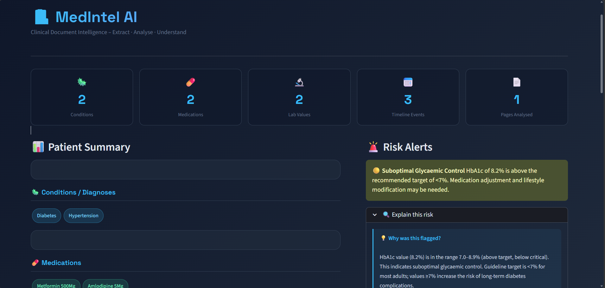
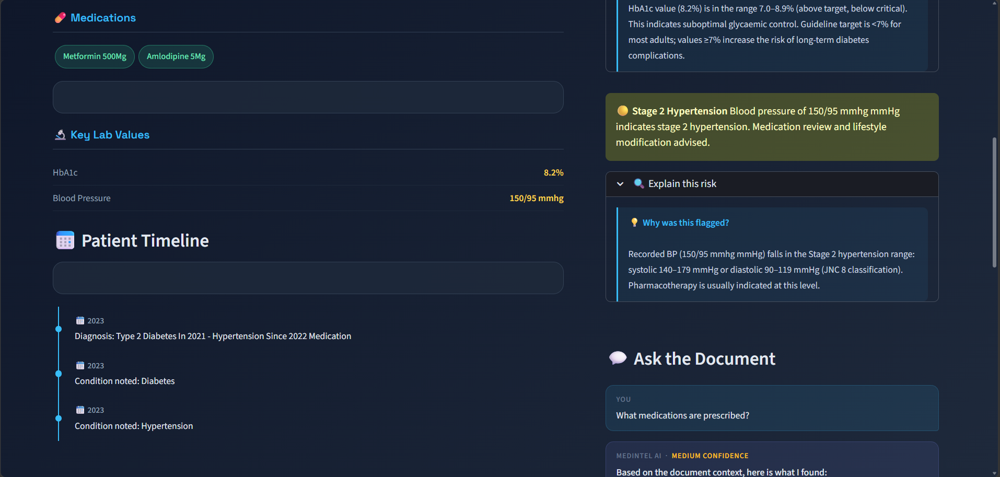
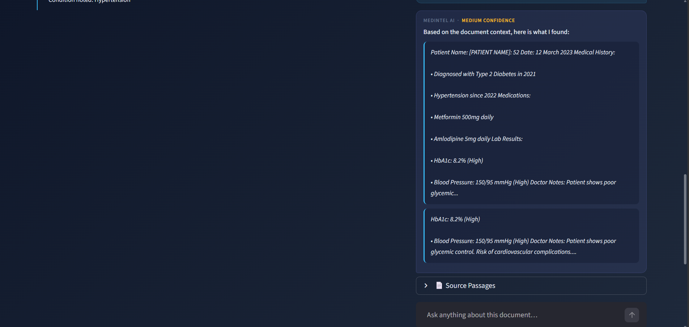

# 🏥 MedIntel AI — Clinical Document Intelligence System

> An AI-powered medical document analysis dashboard built with Python and Streamlit.  
> Upload clinical PDFs and instantly extract diagnoses, medications, lab values, timelines, risk alerts, and get answers through a built-in Q&A chat — all running **100% locally with no paid APIs.**

---

## 📸 Screenshot

> 
> 
> 

---

## ✨ Features

| Feature | Description |
|---|---|
| 📄 **PDF Ingestion** | Extracts text from digital PDFs via `pdfplumber`; falls back to `pytesseract` OCR for scanned documents |
| 🧬 **Medical Entity Extraction** | Identifies diseases, medications, lab values, and dates using `scispacy` NER + regex rules |
| 📅 **Patient Timeline** | Maps clinical events to dates and builds a chronological history automatically |
| 🚨 **Risk Detection** | 11 rule-based risk groups — diabetes control, hypertension, cardiac, renal, anaemia, infection, polypharmacy, and more |
| 📈 **Clinical Trends** | Line charts for lab values (HbA1c, glucose, BP, etc.) plotted over time across multiple visits |
| 💬 **RAG Q&A Chat** | Semantic search with `sentence-transformers` + `ChromaDB` — ask any question about the document |
| 🔒 **Privacy / Anonymization** | GDPR-style toggle that masks patient names, IDs, and contact info before AI processing |

---

## 🗂️ Project Structure

```
medintel-ai/
│
├── app.py              # Streamlit UI — dashboard, layout, all sections
├── ingestion.py        # PDF text extraction (pdfplumber + pytesseract OCR)
├── extraction.py       # Medical NLP — diseases, medications, lab values, dates
├── timeline.py         # Chronological event builder
├── risk.py             # Rule-based clinical risk detection (11 rule groups)
├── rag.py              # Embeddings (sentence-transformers) + ChromaDB + Q&A
├── utils.py            # Shared helpers — chunking, anonymization, deduplication
├── requirements.txt    # All Python dependencies
└── README.md
```

---

## 🚀 Quick Start

### 1. Clone the repository

```bash
git clone https://github.com/SidharthaSagolsem/MedIntel-AI
cd medintel-ai
```

### 2. Create and activate a virtual environment

**Windows (PowerShell):**
```powershell
python -m venv venv
venv\Scripts\Activate.ps1
```

**macOS / Linux:**
```bash
python -m venv venv
source venv/bin/activate
```

### 3. Install dependencies

```bash
pip install -r requirements.txt
```

### 4. Install the medical NLP model

**Option A — scispacy (recommended):**
```bash
pip install https://s3-us-west-2.amazonaws.com/ai2-s2-scispacy/releases/v0.5.3/en_core_sci_sm-0.5.3.tar.gz
```

**Option B — standard spacy fallback (if Option A fails):**
```bash
python -m spacy download en_core_web_sm
```

### 5. (Optional) Install Tesseract OCR for scanned PDFs

| OS | Command |
|---|---|
| Ubuntu/Debian | `sudo apt install tesseract-ocr` |
| macOS | `brew install tesseract` |
| Windows | [Download installer](https://github.com/UB-Mannheim/tesseract/wiki) |

### 6. Run the app

```bash
streamlit run app.py
```

Then open **http://localhost:8501** in your browser.

---

## 🧰 Tech Stack

| Library | Purpose |
|---|---|
| `streamlit` | Web dashboard UI |
| `pdfplumber` | Digital PDF text extraction |
| `pytesseract` | OCR for scanned PDFs |
| `scispacy` | Medical NLP / Named Entity Recognition |
| `dateparser` | Date extraction and normalization |
| `sentence-transformers` | Local text embeddings for semantic search |
| `chromadb` | Vector database for RAG Q&A |
| `pandas` | Lab trend data processing |

---

## 🔒 Privacy

- The **Anonymize Patient Data** toggle (on by default) strips patient names, IDs, phone numbers, and email addresses before the AI processes the document.
- All processing is **fully local** — no data is sent to any external API or cloud service.

---

## ⚠️ Disclaimer

MedIntel AI is an **educational and research project only.**  
It is **not** a certified medical device and should **not** be used for real clinical decision-making.  
Always consult a qualified healthcare professional for medical advice.

---

## 🤝 Contributing

Pull requests are welcome! For major changes, please open an issue first to discuss what you'd like to change.

---

## 📄 License

This project is licensed under the [MIT License](LICENSE).

---

## 👤 Author

Sidhartha Sagolsem 
[GitHub](https://github.com/SidharthaSagolsem) · [LinkedIn](https://www.linkedin.com/in/sidhartha-sagolsem/)
